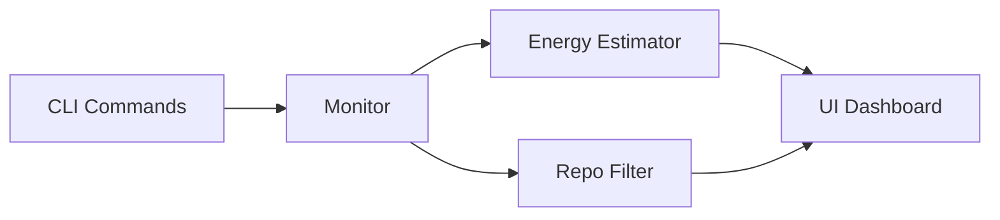

<div align="center">
<p align="center">
  
</p>
	
[](https://github.com/AppajiDheeraj/GreenTrace/actions/workflows/ci.yml)
[](go.mod)
[](https://github.com/AppajiDheeraj/GreenTrace/releases)

**CarbonQT is a cross-platform terminal UI that estimates per-process energy and carbon impact, highlights top emitters, and lets you act fast with keyboard-driven controls.**

</div>

## Overview

CarbonQT continuously samples system processes and presents a live dashboard that combines CPU, memory, power, and carbon estimates. It is built for quick inspection during development and ops workflows, especially when you want a fast signal on the most expensive processes running on your machine.

## Key Features

- Live system overview (CPU, RAM, platform, uptime)
- Top carbon process summary
- Process table with CPU, memory, power, carbon, runtime, and path
- Keyboard navigation with a kill action
- Repo-aware filtering to focus on current workspace

## Architecture

CarbonQT is organized as a small CLI with composable internal packages:

- `cmd/` for CLI commands and flags
- `internal/monitor/` for system and process sampling
- `internal/energy/` for power and carbon estimation
- `internal/ui/` for dashboard rendering and interactions
- `internal/repo/` for repo detection and filtering



## Quick Start

```bash
go build -o carbonqt
./carbonqt dashboard
```

## Install and Run

```bash
git clone https://github.com/kshama-jay247/CarbonQT_CLI
cd CarbonQT_CLI
go build -o carbonqt
./carbonqt dashboard
```

## Commands

- `carbonqt dashboard` - launch the interactive dashboard
- `carbonqt run 10s` - monitor for a fixed duration and print a report
- `carbonqt top` - show top processes by carbon emissions
- `carbonqt query chrome` - search running processes by name
- `carbonqt completion powershell` - generate shell completion script

## Flags

- `--repo-only` (default: false) - restrict process list to the current repository
- `--cpu-tdp` - CPU TDP in watts (default: 65)
- `--emission-factor` - kg CO2 per joule (default: 2e-10)

## Controls (Dashboard)

- Up/Down - navigate processes
- Space - select a process
- `k` - kill selected process
- `q` - quit

## Notes

- On some systems, killing processes may require elevated permissions.
- Process paths can be long and are truncated in the table for readability.


## Release and Tagging

Build release artifacts locally:

```bash
./scripts/build-release.sh
```

On Windows PowerShell:

```powershell
./scripts/build-release.ps1
```

For release notes, use GitHub Releases and summarize key changes.
